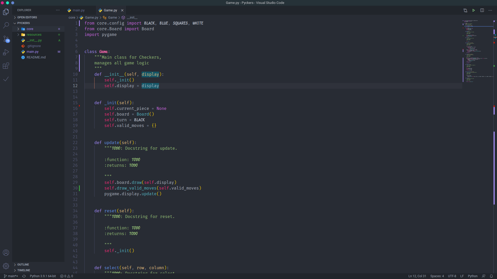

# Visual Studio Code 
  

Settings file for Visual Studio Code. Enables font ligatures and italics.

### Pre-requisites
Fonts:
 - Fira Code iScript https://github.com/kencrocken/FiraCodeiScript
 - Source Code Pro https://fonts.google.com/specimen/Source+Code+Pro

Extensions:

 - Bracket Pair Colorized
 - Eva Theme
 - Material Icon Theme
 - Polacode
 - Prettier - Code formatter
 - Java Extension Pack
 - C/C++
 - Pylance
 - Visual Studio Intellicode

## Screenshots

